# 🌈🌈🌈

# PHYSICS with Cannon

<br>
<br>
<br>

### INSTALL cannonjs 🐖

```javascript
npm three
//
npm install cannon
```

<br>
<br>

### IMPORT IT ☁️

<br>

#### HOW THE SCENE should look like before we start adding all the OBJECTS

```javascript
//
// -------------------------
// IMPORTS **
//
import React, { Component } from "react";
import * as THREE from "three";
import { GUI } from "three/examples/jsm/libs/dat.gui.module.js";
import { OrbitControls } from "three/examples/jsm/controls/OrbitControls";
import "cannon/build/cannon.min.js";
//
// -------------------------
//
const style = {
  height: 600, // we can control scene size by setting container dimensions
};

class PhysicsTestOneCannon extends Component {
  componentDidMount() {
    // Here you are calling all the functions below
    this.sceneSetup();
    this.addCustomSceneObjects();
    this.startAnimationLoop();
    //
    window.addEventListener("resize", this.handleWindowResize);
  }
  //
  //
  componentWillUnmount() {
    // this is related to the event listeners that cause problems when using the resizing
    window.removeEventListener("resize", this.handleWindowResize);
    window.cancelAnimationFrame(this.requestID);
    // this.controls.dispose();
  }
  /*

                                            ***  1   ***

  */
  sceneSetup = () => {
    const scene = new THREE.Scene();
    const axesHelper = new THREE.AxesHelper(5);
    scene.add(axesHelper);
    //
    //                WIDTH/HEIGHT
    // --------------------------------------------
    //
    const width = this.eleModelBlOne.clientWidth;
    const height = this.eleModelBlOne.clientHeight;
    //
    // --------------------------------------------

    this.camera = new THREE.PerspectiveCamera(
      75,
      window.innerWidth / window.innerHeight,
      1,
      1000
    );
    this.camera.position.y = 10;
    //
    // this.camera.position.z = 3;
    //
    this.scene = new THREE.Scene();
    // this.scene.background = new THREE.Color(0xffffff);
    //
    //
    this.loader = new THREE.TextureLoader();
    //
    // ---------------------------------------
    //                  RENDERER
    // ---------------------------------------
    //
    this.renderer = new THREE.WebGL1Renderer({
      alpha: true,
      // will make the edges smooth
      antialias: true,
    });
    //
    this.renderer.setSize(width, height);
    // BG color from the scene
    // showMap is connected to the shadows in any object/model
    this.renderer.shadowMap.enabled = true;
    // here you append it to the jsx
    this.eleModelBlOne.appendChild(this.renderer.domElement); // mount using React ref
    // document.appendChild(this.renderer.domElement);  //before
    //
    //
  };

  /*
                                            ***  2  ***


  */
  addCustomSceneObjects = () => {
    //
    //---------------------------
    //     CONTROLS
    //---------------------------

    //----------------------------------
    //         BLENDER  MODELS
    //----------------------------------
    //

    //---------------------
    //   Directional Light
    //---------------------
    //
    // //
    this.renderer.outputEncoding = THREE.sRGBEncoding;
    this.renderer.shadowMap.enabled = true;
    this.renderer.shadowMap.autoUpdate = true;
    this.renderer.gammaFactor = 2.2;

    const directionalLight = new THREE.DirectionalLight(0xffffff);
    directionalLight.position.set(5, -1, 100);

    // position as follow , the light comes from x:-1000, comes from: y and the last comes from : z
    directionalLight.position.set(1000, 1000, 1000);
    directionalLight.castShadow = true;
    directionalLight.shadow.camera = new THREE.OrthographicCamera(
      -100,
      200,
      -200,
      200,
      0.5,
      5000
    );
    // //
    this.scene.add(directionalLight);
    // The light points to the flat ground
    // this.directionalLight.target = this.plane;  //dont add this
    //
    //
    //THIS LIGHT IS ON THE BOTTOM
    //---------------------
    //     spotLight FF5733
    //---------------------
    //

    // With the light you can see the colors you added to each geometry in the materials
    this.spotLight = new THREE.SpotLight(0xffffff, 0.5); //intensity:   0.5);
    // spotLight.position.set( 0 , 10 , 0 );
    this.spotLight.position.set(5, -50, 0); //x, y , z   original (5, -50, 0);
    // (2, 32, 32); with this settings the light will be on the front
    this.spotLight.castShadow = true;
    //
    // this will remove the shadows
    this.spotLight.visible = true;
    //
    this.scene.add(this.spotLight);
    // //
    //
    //
  };
  /*


                                            ***  3   ***


  */

  startAnimationLoop = () => {
    //

    this.requestID = window.requestAnimationFrame(this.startAnimationLoop);

    this.renderer.render(this.scene, this.camera);
  };
  /*


  */
  handleWindowResize = () => {
    const width = this.eleModelBlOne.clientWidth;
    const height = this.eleModelBlOne.clientHeight;
    //
    // updated renderer
    this.renderer.setSize(width, height);
    // updated **camera** aspect ratio
    this.camera.aspect = width / height;
    // That is the Three.js optimization: you can group multiple camera changes into a block with only one
    this.camera.updateProjectionMatrix();
  };
  /*

  */

  render() {
    return (
      <div className="scene-oblivion">
        {/* --------------------- */}
        <div
          className="modelBleOne"
          style={style}
          ref={(ref) => (this.eleModelBlOne = ref)}
        ></div>

        {/* --------------------- */}
      </div>
    );
  }
}

export default PhysicsTestOneCannon;
```

<br>
<br>
<br>

## 🍨

### ADD THE ORBITS CONTROL

```javascript
//---------------------------
//     CONTROLS
//---------------------------
// OrbitControls allow a camera to orbit around the object
// https://threejs.org/docs/#examples/controls/OrbitControls
this.controls = new OrbitControls(this.camera, this.renderer.domElement);
```

<br>
<br>

### ADD THE CANNONjs to the scene

- You are going to have an **error** after adding the following: 🔴

```javascript
const world = new CANNON.World();
world.gravity.set(0, -9.82, 0);
// //world.broadphase = new CANNON.NaiveBroadphase() //
// //world.solver.iterations = 10
// //world.allowSleep = true
```

- **The Reason** for that Error is because **you haven't install the _TYPES_**

- In the tutorial I am following, it says I have to create a typescript file, but since i am not working with typescript I might have to find another way.

<br>

# 👾

#### ANOTHER WAY

- _**INSTALL**_ THE TYPES

```javascript
// https://www.npmjs.com/package/@types/cannon
 npm install --save @types/cannon
```

<br>

#### IMPORT IT ☁️

- I added these 3 lines because I still don't know which one will work when i will start building the scene

```javascript
import "cannon/build/cannon.min.js";
import * as CANNON from "cannon";
import cannon from "cannon";

//
//
//
  addCustomSceneObjects = () => {

    const world = new CANNON.World();
    world.gravity.set(0, -9.82, 0);
    //
    //
    // -----------------
    // WE DONT NEED THE LINES BELOW (NOT in the moment)
    // //world.broadphase = new CANNON.NaiveBroadphase() //
    // //world.solver.iterations = 10
    // //world.allowSleep = true
    //
    //
```

- The import was succesful if after typing the dot "after" CANNON you can see all these options

<br>

[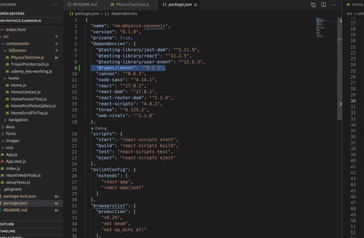]()

<br>
<br>

# 🌈

## ADDING THE FIRST GEOMETRIES

- ITS MOVING LIKE THAT because of the **ORBITS CONTROL**

[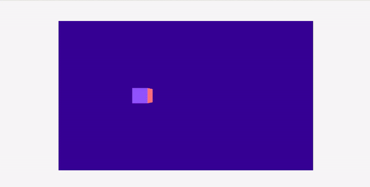]()

```javascript
//----------------------------------
//          MODELS / Mesh
//----------------------------------
//
//
//
this.normalMaterial = new THREE.MeshNormalMaterial();
this.phongMaterial = new THREE.MeshPhongMaterial();
//
//
//
//-----------------
//  CUBE
//-----------------
this.cubeGeometry = new THREE.BoxGeometry(1, 1, 1);
this.cubeMesh = new THREE.Mesh(this.cubeGeometry, this.normalMaterial);
this.cubeMesh.position.x = -3;
this.cubeMesh.position.y = 3;
this.cubeMesh.castShadow = true;
this.scene.add(this.cubeMesh);
//
//
//-----------------
//  SPHERE
//-----------------
this.sphereGeometry = new THREE.SphereGeometry();
this.sphereMesh = new THREE.Mesh(this.sphereGeometry, this.normalMaterial);
this.sphereMesh.position.x = -1;
this.sphereMesh.position.y = 3;
this.sphereMesh.castShadow = true;
this.scene.add(this.sphereMesh);
//
//
//-----------------
//  Icosahedron
//-----------------
//icosahedron is a polyhedron with 20 faces.
//
this.icosahedronGeometry = new THREE.IcosahedronGeometry(1, 0);
this.icosahedronMesh = new THREE.Mesh(
  this.icosahedronGeometry,
  this.normalMaterial
);
this.icosahedronMesh.position.x = 1;
this.icosahedronMesh.position.y = 3;
this.icosahedronMesh.castShadow = true;
this.scene.add(this.icosahedronMesh);
//
//
//-----------------
//  torusKnot
//-----------------
//
this.torusKnotGeometry = new THREE.TorusKnotGeometry();
this.torusKnotMesh = new THREE.Mesh(
  this.torusKnotGeometry,
  this.normalMaterial
);
this.torusKnotMesh.position.x = 4;
this.torusKnotMesh.position.y = 3;
this.torusKnotMesh.castShadow = true;
this.scene.add(this.torusKnotMesh);
//
//
//-----------------
//  PLANE / FLOOR
//-----------------
//
this.planeGeometry = new THREE.PlaneGeometry(25, 25);
this.planeMesh = new THREE.Mesh(this.planeGeometry, this.phongMaterial);
this.planeMesh.rotateX(-Math.PI / 2);
this.planeMesh.receiveShadow = true;
this.scene.add(this.planeMesh);
//
//
```

### PREVIEW

[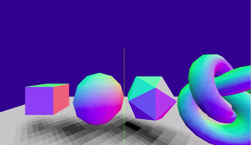]()

<br>
<br>
<br>
<br>

# 🌈

### REMOVING THE PIXILATED SHADOW

<br>

- If you don't add **"THREE.PCFSoftShadowMap"** , you will have the shadow but it will be pixelated and **FUGLY**

```javascript
//  add this
this.renderer.shadowMap.type = THREE.PCFSoftShadowMap;
//
```

<br>

### What are the possible shadowMapTypes?

- PCFShadowMap
- PCFSoftShadowMap
- PCFBasicShadowMap

```javascript
THREE.BasicShadowMap = 0;
THREE.PCFShadowMap = 1;
THREE.PCFSoftShadowMap = 2;
```

# 🐖

#### MORE ABOUT THIS:

[SOFT SHADOWS WITH PCF](https://fabiensanglard.net/shadowmappingPCF/)
<br>

[How to use PCF (SOFT) shadows in three.js?](https://stackoverflow.com/questions/60907801/how-to-use-pcf-soft-shadows-in-three-js)
<br>

# 🌵

##### Can be interesting

[Three.js - Why is the shadow of these items looking like this?](https://stackoverflow.com/questions/47996510/three-js-why-is-the-shadow-of-these-items-looking-like-this/)

[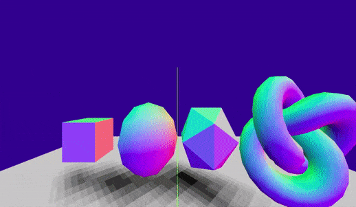]()

<br>
<br>
<br>
<br>

# 🔥

## REPLACING THE LIGHTS

[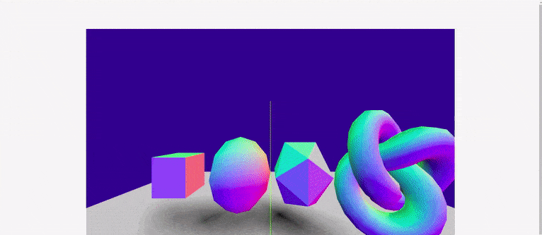]()

```javascript
// from this
//---------------------
//   Directional Lights
//---------------------

this.renderer.outputEncoding = THREE.sRGBEncoding;
this.renderer.shadowMap.enabled = true;
this.renderer.shadowMap.autoUpdate = true;
this.renderer.gammaFactor = 2.2;

const directionalLight = new THREE.DirectionalLight(0xffffff);
directionalLight.position.set(5, -1, 100);

// position as follow , the light comes from x:-1000, comes from: y and the last comes from : z
directionalLight.position.set(1000, 1000, 1000);
directionalLight.castShadow = true;
directionalLight.shadow.camera = new THREE.OrthographicCamera(
  -100,
  200,
  -200,
  200,
  0.5,
  5000
);
// //
this.scene.add(directionalLight);
// The light points to the flat ground
// this.directionalLight.target = this.plane;  //dont add this
//
//
//THIS LIGHT IS ON THE BOTTOM
//---------------------
//     spotLight FF5733
//---------------------
//

// With the light you can see the colors you added to each geometry in the materials
this.spotLight = new THREE.SpotLight(0xffffff, 0.5); //intensity:   0.5);
// spotLight.position.set( 0 , 10 , 0 );
this.spotLight.position.set(5, -50, 0); //x, y , z   original (5, -50, 0);
// (2, 32, 32); with this settings the light will be on the front
this.spotLight.castShadow = true;
//
// this will remove the shadows
this.spotLight.visible = true;
//
this.scene.add(this.spotLight);
// //
//
//

// to this  ***

//
//
//---------------------
//    New Lights
//---------------------
// lights 1
this.light1 = new THREE.SpotLight();
this.light1.position.set(2.5, 5, 5);
this.light1.angle = Math.PI / 4;
this.light1.penumbra = 0.5;
this.light1.castShadow = true;
this.light1.shadow.mapSize.width = 1024;
this.light1.shadow.mapSize.height = 1024;
this.light1.shadow.camera.near = 0.5;
this.light1.shadow.camera.far = 20;
this.scene.add(this.light1);
// //
// //
this.light2 = new THREE.SpotLight();
this.light2.position.set(-2.5, 5, 5);
this.light2.angle = Math.PI / 4;
this.light2.penumbra = 0.5;
this.light2.castShadow = true;
this.light2.shadow.mapSize.width = 1024;
this.light2.shadow.mapSize.height = 1024;
this.light2.shadow.camera.near = 0.5;
this.light2.shadow.camera.far = 20;
this.scene.add(this.light2);
//
//
```

[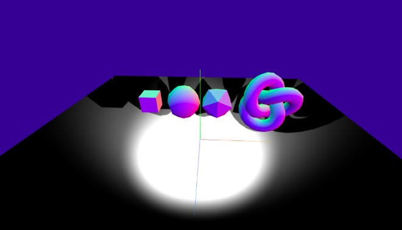]()

<br>
<br>
<br>

# 🌈

# PHYSICS with CANNON

#### ADD THE FOLLOWING:

- add the following under the First block of the cube

```javascript
this.cubeShape = new CANNON.Box(new CANNON.Vec3(0.5, 0.5, 0.5));
this.cubeBody = new CANNON.Body({ mass: 1 });
this.cubeBody.addShape(this.cubeShape);
this.cubeBody.position.x = this.cubeMesh.position.x;
this.cubeBody.position.y = this.cubeMesh.position.y;
this.cubeBody.position.z = this.cubeMesh.position.z;
world.addBody(this.cubeBody);
```

- You are not going to see anything as you must to add something in the animation FUNCTION

- **YOU NEED TO "update the World"** TO SEE what s going on
  <br>

- **BUT BEFORE** add the **"clock"** like we have done in the previous examples

```javascript
     // JUST BEFORE the end of the:    addCustomSceneObjects = () => {
    this.clock = new THREE.Clock();
    //
    //
    //
  };


  startAnimationLoop = () => {
    //
```

<br>

# 🐖

#### **NOW ADD THE CLOCK inside the animation function**

<br>

- YOU ARE GOING TO HAVE AN **ERROR** HERE 🔴

```javascript
startAnimationLoop = () => {
  //

  this.requestID = window.requestAnimationFrame(this.startAnimationLoop);

  this.controls.update();
  this.delta = this.clock.getDelta(); // HERE *****
  this.world.step(this.delta); //error **  GO UP where the world is (above the geometries)

  this.renderer.render(this.scene, this.camera);
};
```

<br>

#### GO UP where the world is (above the geometries)

- **CHANGE** THIS:

```javascript
// change this:

const world = new CANNON.World();
world.gravity.set(0, -9.82, 0);
// //world.broadphase = new CANNON.NaiveBroadphase() //
// //world.solver.iterations = 10
// //world.allowSleep = true

// for this:

this.world = new CANNON.World();
this.world.gravity.set(0, -9.82, 0);
// //world.broadphase = new CANNON.NaiveBroadphase() //
// //world.solver.iterations = 10
// //world.allowSleep = true
```

#### ADD THE FOLLOWING inside the animation function

- THIS is going to initiate the physics animation

```javascript
startAnimationLoop = () => {
  //  All the rest ...
  //
  //---------------- NEW ****
  //
  // With this, you will finally seei what the "world" is doing.
  // the normal cube will connect with the cannon cube
  this.cubeMesh.position.set(
    this.cubeBody.position.x,
    this.cubeBody.position.y,
    this.cubeBody.position.z
  );
  // ------------------------

  this.renderer.render(this.scene, this.camera);
};
```

#### RESULTS

[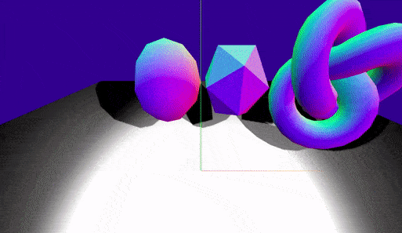]()

### Lets use the QUATERNION to update the rotation of the cube

```javascript
// ROTATION
this.cubeMesh.quaternion.set(
  this.cubeBody.quaternion.x,
  this.cubeBody.quaternion.y,
  this.cubeBody.quaternion.z,
  this.cubeBody.quaternion.w
);
```

<br>
<br>
<br>

### 🌈

### LETS add something to stop the cube from falling to oblivion

```javascript
//-----------------
//  PLANE / FLOOR
//-----------------
//
this.planeGeometry = new THREE.PlaneGeometry(25, 25);
this.planeMesh = new THREE.Mesh(this.planeGeometry, this.phongMaterial);
this.planeMesh.rotateX(-Math.PI / 2);
this.planeMesh.receiveShadow = true;
this.scene.add(this.planeMesh);
//
//
//
//                      NEW **
// CANNON
this.planeShape = new CANNON.Plane();
this.planeBody = new CANNON.Body({ mass: 0 });
this.planeBody.addShape(this.planeShape);
this.planeBody.quaternion.setFromAxisAngle(
  new CANNON.Vec3(1, 0, 0),
  -Math.PI / 2
);
this.world.addBody(this.planeBody);
```

#### RESULT

- the plane Cannon stops the box

[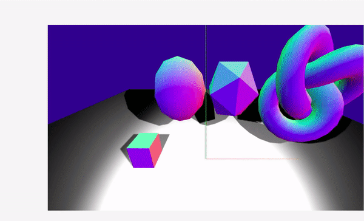]()

<br>
<br>
<br>
<br>

# 🏟️

# Lets add the stats and the Gui panel

- import it

```javascript
import { GUI } from "three/examples/jsm/libs/dat.gui.module.js";
import Stats from "three/examples/jsm/libs/stats.module.js";
```

## use it

```javascript
//--------------------------
    //          STATS
    //
    this.stats = Stats();
    this.eleModelBlOne.appendChild(this.stats.dom);
    //
    //
    //--------------------------
    //          GUI panel
    //
    this.gui = new GUI();
    //
    //--------------------------
    //          Clock
    //
    this.clock = new THREE.Clock();
    //
    //
    //
  };
    //  3

  startAnimationLoop = () => {
    //
    this.requestID = window.requestAnimationFrame(this.startAnimationLoop);
    //  STATS **
    this.stats.update();
    //
    this.renderer.render(this.scene, this.camera);
  };
```

<br>
 
 - check the 2 little boxes on top right and top left of the page

- the stats will tell how many FPS (frames per second) your stuff is taking.

<br>

[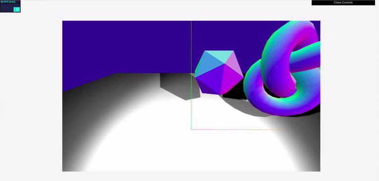]()

<br>

## FPS

[Limiting framerate in Three.js to increase performance, requestAnimationFrame?](https://stackoverflow.com/questions/11285065/limiting-framerate-in-three-js-to-increase-performance-requestanimationframe)

<br>

[Determining the frame rate for your scene](https://subscription.packtpub.com/book/web_development/9781783981182/1/ch01lvl1sec15/determining-the-frame-rate-for-your-scene)

<br>

[VIDEO |Three.js Tutorial 8 - FPS (Frames Per Second/Framerate)](https://www.youtube.com/watch?v=brPnECREIxs)

<br>

```javascript
//--------------------------
    //          STATS
    //
    this.stats = Stats();
    document.body.appendChild(this.stats.dom);
    //
    //
    //--------------------------
    //          GUI panel
    //
    this.gui = new GUI();
    //
    //--------------------------
    //          Clock
    //
    this.clock = new THREE.Clock();
    this.delta = 0;
    // 30 fps
    this.interval = 1 / 30;
    //
    //
    //
  };
  /*


                                            ***  3   ***


  */

  startAnimationLoop = () => {
    //

    this.requestID = window.requestAnimationFrame(this.startAnimationLoop);

    // this.requestID = window.requestAnimationFrame(this.startAnimationLoop);

    this.controls.update();
    //
    this.delta += this.clock.getDelta();
    // if (delta > .1) delta = .1
    //
    if (this.delta > this.interval) {
      // The draw or time dependent code are here
      this.delta = 0.1; //try removing this line :)
      this.delta = this.delta % this.interval;
    }
    //
    //
    //
    // HERE WE NEED TO update THE WORLD
    this.world.step(this.delta); //DELTA is what will cause the never ending animation
    //
    //---------------------------
```

<br>
<br>

# 🌈 ☁️ 🐄

### UPDATE THE OTHER RELEVANT CANNON GEOMETRIES (sphere and plane)

##### THE MASS CANNON.Body({ mass: 1 })

<br>

- **If you add 0**, its not going to FALL, because its not affected by Gravity.

- **Mass 1** means its going to be affected by gravity, if you add **Mass 2**, it will twice as heavy.

<br>

##### Positioning

- Keep in mind the the positioning of the sphere Cannon is related to the positioning of the sphere threejs

```javascript
  //-----------------
    //  SPHERE
    //-----------------
    this.sphereGeometry = new THREE.SphereGeometry();
    this.sphereMesh = new THREE.Mesh(this.sphereGeometry, this.normalMaterial);
    this.sphereMesh.position.x = -1;
    this.sphereMesh.position.y = 3;
    this.sphereMesh.castShadow = true;
    this.scene.add(this.sphereMesh);
    //
    //
    //  Sphere CANNON **
    //
    this.sphereShape = new CANNON.Sphere(1);
    this.sphereBody = new CANNON.Body({ mass: 1 }); //If you add 0, its not going to FALL, because its not affected by Gravity
    // mass 1 means its going to be affected by gravity, if you add 2, it will twice as heavy
    // Keep in mind the the positioning of the sphere Cannon is related to the positioning of the sphere threejs
    this.sphereBody.addShape(this.sphereShape);
    this.sphereBody.position.x = this.sphereMesh.position.x;
    this.sphereBody.position.y = this.sphereMesh.position.y;
    this.sphereBody.position.z = this.sphereMesh.position.z;
    this.world.addBody(this.sphereBody);
    //


    //-----------------
    //  PLANE / FLOOR
    //-----------------
    //
    this.planeGeometry = new THREE.PlaneGeometry(25, 25);
    this.planeMesh = new THREE.Mesh(this.planeGeometry, this.phongMaterial);
    this.planeMesh.rotateX(-Math.PI / 2);
    this.planeMesh.receiveShadow = true;
    this.scene.add(this.planeMesh);
    //
    // plane CANNON **
    this.planeShape = new CANNON.Plane(); //the plane in cannnon goes to infinity
    this.planeBody = new CANNON.Body({ mass: 0 }); //when the mass is at 0, it means it s not going to be affected by Gravity
    // mass 1 means its going to be affected by gravity, if you add 2, it will twice as heavy
    this.planeBody.addShape(this.planeShape);
    //
    //this line here is equivalent to this line from the threejs plane:   this.planeMesh.rotateX(-Math.PI / 2);
    this.planeBody.quaternion.setFromAxisAngle(
      new CANNON.Vec3(1, 0, 0),
      -Math.PI / 2
    );
    this.world.addBody(this.planeBody);
    //
    //

    //--------------------------
    //          STATS
    //
    this.stats = Stats();
     document.body.appendChild(this.stats.dom);
    //
    //
    //--------------------------
    //          GUI panel
    //
    this.gui = new GUI();
    //
    //--------------------------
    //          Clock
    //
    this.clock = new THREE.Clock();
    //
    //
    //
  };
  /*

                                            ***  3   ***
  */

  startAnimationLoop = () => {
    /
    this.requestID = window.requestAnimationFrame(this.startAnimationLoop);

    this.controls.update();
    this.delta = this.clock.getDelta();
    // if (delta > .1) delta = .1
    //
    // HERE WE NEED TO update THE WORLD
    this.world.step(this.delta); //DELTA is what will cause the never ending animation
    //
    //---------------------------
    // The following is going to  Copy coordinates from Cannon.js to Three.js
    //
    // FALLING CUBE
    // Here you are finally seeing what the "world" is doing
    // c
    this.cubeMesh.position.set(
      this.cubeBody.position.x,
      this.cubeBody.position.y,
      this.cubeBody.position.z
    );
    // rotation
    this.cubeMesh.quaternion.set(
      this.cubeBody.quaternion.x,
      this.cubeBody.quaternion.y,
      this.cubeBody.quaternion.z,
      this.cubeBody.quaternion.w
    );
    //
    // ------ *
    //
    // SPHERE CANNON
    this.sphereMesh.position.set(
      this.sphereBody.position.x,
      this.sphereBody.position.y,
      this.sphereBody.position.z
    );
    this.sphereMesh.quaternion.set(
      this.sphereBody.quaternion.x,
      this.sphereBody.quaternion.y,
      this.sphereBody.quaternion.z,
      this.sphereBody.quaternion.w
    );
    //
    // ------ *
    //
    //---------------------------
    //
    //
    //
    //
    this.stats.update();
    //
    this.renderer.render(this.scene, this.camera);
  };
```

<br>
<br>

## CHANGING THE SPHERE SHAPE TO A CUBE?

- APPARENTLY Its a common practice in 3D Games to give different shapes to geometries that are (computational expensive to process), like for example torusKnot, they use lots of it and can overload the fps.

- **SO WHAT WE ARE GOING TO DO**, is to draw a sphere with threejs to make the Physics World think its a Cube.

<br>

👾

#### COPY THE CUBE SHAPE from cannon

```javascript
//b
// Cube CANNON **
this.cubeShape = new CANNON.Box(new CANNON.Vec3(0.5, 0.5, 0.5));
```

👾

#### and paste it (inside the sphere cannon)

```javascript
//b
// Cube CANNON **
this.sphereShape = new CANNON.Box(new CANNON.Vec3(0.5, 0.5, 0.5)); //new CANNON.sphere(1)
```

<br>

#### SO AS I SAID ...

##### it s common in 3d games, the appearance of an object doesn't match the physics world version of an object, because for example objects like the "torusKnot" are very computational expensive to process.

<br>
<br>
<br>

# 🌈

### LETS ADD SOME GRAVITY CONTROLS (gui panel)

- add THE FOLLOWING under the stats (before the animation function)

```javascript
const gui = new GUI();
const physicsFolder = gui.addFolder("Physics");
physicsFolder.add(world.gravity, "x", -10.0, 10.0, 0.1);
physicsFolder.add(world.gravity, "y", -10.0, 10.0, 0.1);
physicsFolder.add(world.gravity, "z", -10.0, 10.0, 0.1);
physicsFolder.open();
```

## DONE !!!

- **(click on the image to see the result)**

# 🐖

[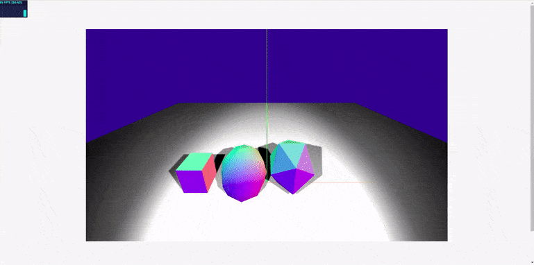](https://nadiamariduena.github.io/nm-physics-cannonjs/)

#### COMMON PROBLEMS

- I couldnt make it with the Torus knot, I think its because the person who created this tutorial added a file using typescript and of course i cannot use, unless it was something else. but i will ask him.

<br>
<br>
<br>
<br>

# ☕ 🌈

## INTERESTING LINKS (Beginner)

[Physics with Cannon.js](https://sbcode.net/threejs/physics-cannonjs/)

[Examples : Helicopter Physics](https://sbcode.net/threejs/physics-heli/)

[ Examples : Car Physics](https://sbcode.net/threejs/physics-car/)

[ Multiple objects/models falling](https://sbcode.net/threejs/compounds-versus-convex-polyhedrons/)

[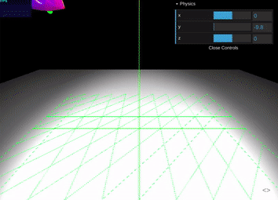](https://sbcode.net/threejs/compounds-versus-convex-polyhedrons/)

<br>

# 🍌

[What should I use for collision detection in three.js (Physijs, cannon, only three.js)](https://discourse.threejs.org/t/what-should-i-use-for-collision-detection-in-three-js-physijs-cannon-only-three-js/2240)

<br>

[Collision “Event Listener” in Three.js](https://medium.com/javascript-in-plain-english/collision-event-listener-in-three-js-12055fcb2b4a)

<br>
<br>
<br>

# 🍰

#### INTERESTING LINKS (advanced)

#### three-pathfinding

- Currently, this library **does not accept** the **custom navigation mesh** file formats created by tools like Recast. Instead, you will need to export the navigation mesh to a 3D model format (like OBJ or glTF) and then load it with one of the three.js loaders, like THREE.OBJLoader or THREE.GLTFLoader. The library accepts a THREE.BufferGeometry instance, and follows the +Y=Up convention of three.js and glTF.

[donmccurdy/three-pathfinding](https://github.com/donmccurdy/three-pathfinding)

[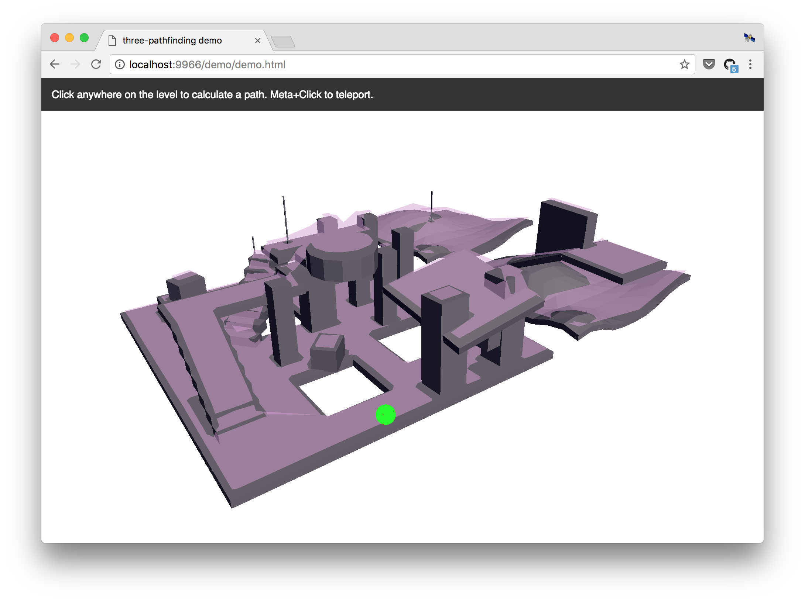](https://github.com/donmccurdy/three-pathfinding)

[How to walk model on obj zone & find nearest path by zones](https://discourse.threejs.org/t/how-to-walk-model-on-obj-zone-find-nearest-path-by-zones/1683/8)

<br>

[Gravity (three.js / instancing / glsl)](https://https://codepen.io/usefulthink/pen/YNrvpY?editors=0010)

<!--

MULTIPLE OBEJECTS FALLING


https://sbcode.net/threejs/compounds-versus-convex-polyhedrons/


import * as THREE from '/build/three.module.js'
import { OrbitControls } from '/jsm/controls/OrbitControls'
import Stats from '/jsm/libs/stats.module'
import { GUI } from '/jsm/libs/dat.gui.module'
import '/cannon/cannon.min'
import CannonDebugRenderer from './utils/cannonDebugRenderer.js'
import CannonUtils from './utils/cannonUtils.js'
import { OBJLoader } from '/jsm/loaders/OBJLoader'

const scene: THREE.Scene = new THREE.Scene()
const axesHelper = new THREE.AxesHelper(5)
scene.add(axesHelper)

var light1 = new THREE.SpotLight();
light1.position.set(2.5, 5, 5)
light1.angle = Math.PI / 4
light1.penumbra = 0.5
light1.castShadow = true;
light1.shadow.mapSize.width = 1024;
light1.shadow.mapSize.height = 1024;
light1.shadow.camera.near = 0.5;
light1.shadow.camera.far = 20
scene.add(light1);

var light2 = new THREE.SpotLight();
light2.position.set(-2.5, 5, 5)
light2.angle = Math.PI / 4
light2.penumbra = 0.5
light2.castShadow = true;
light2.shadow.mapSize.width = 1024;
light2.shadow.mapSize.height = 1024;
light2.shadow.camera.near = 0.5;
light2.shadow.camera.far = 20
scene.add(light2);

const camera: THREE.PerspectiveCamera = new THREE.PerspectiveCamera(75, window.innerWidth / window.innerHeight, 0.1, 1000)

const renderer: THREE.WebGLRenderer = new THREE.WebGLRenderer()
renderer.setSize(window.innerWidth, window.innerHeight)
renderer.shadowMap.enabled = true
renderer.shadowMap.type = THREE.PCFSoftShadowMap
document.body.appendChild(renderer.domElement)

const controls = new OrbitControls(camera, renderer.domElement)
controls.screenSpacePanning = true

const world = new CANNON.World()
world.gravity.set(0, -9.82, 0)
//world.broadphase = new CANNON.NaiveBroadphase() //
//world.solver.iterations = 10
//world.allowSleep = true

const normalMaterial: THREE.MeshNormalMaterial = new THREE.MeshNormalMaterial()
const phongMaterial: THREE.MeshPhongMaterial = new THREE.MeshPhongMaterial()

let monkeyMeshes: THREE.Object3D[] = new Array()
let monkeyBodies: CANNON.Body[] = new Array()
let monkeyLoaded: Boolean = false

const objLoader: OBJLoader = new OBJLoader();
objLoader.load(
    'models/monkey.obj',
    //'models/monkeyPhysics.obj',
    (object) => {
        //scene.add(object)

        const monkeyMesh = object.children[0];
        (monkeyMesh as THREE.Mesh).material = normalMaterial;
        (<THREE.MeshNormalMaterial>(<THREE.Mesh>monkeyMesh).material).flatShading = true

        // let monkeyMesh: THREE.Object3D
        // let monkeyCollisionMesh: THREE.Object3D
        // object.traverse(function (child) {
        //     console.log(child.name)
        //     if (child.name === "Suzanne") {
        //         monkeyMesh = child;
        //         (monkeyMesh as THREE.Mesh).material = normalMaterial
        //     } else if (child.name.startsWith("physics")) {
        //         monkeyCollisionMesh = child;
        //     }
        // })

        for (let i = 0; i < 200; i++) {
            const monkeyMeshClone = monkeyMesh.clone()
            monkeyMeshClone.position.x = Math.floor(Math.random() * 10) - 5
            monkeyMeshClone.position.z = Math.floor(Math.random() * 10) - 5
            monkeyMeshClone.position.y = 5 + i
            scene.add(monkeyMeshClone)
            monkeyMeshes.push(monkeyMeshClone)

            //const monkeyShape = CannonUtils.CreateTrimesh((monkeyMesh as THREE.Mesh).geometry)
            //const monkeyShape = CannonUtils.CreateConvexPolyhedron(new THREE.IcosahedronGeometry(1))
            //const monkeyShape = CannonUtils.CreateConvexPolyhedron((monkeyMesh as THREE.Mesh).geometry)
            //const monkeyShape = CannonUtils.CreateConvexPolyhedron((monkeyCollisionMesh as THREE.Mesh).geometry)
            const monkeyBody = new CANNON.Body({ mass: 1 });
            //monkeyBody.addShape(monkeyShape)
            monkeyBody.addShape(new CANNON.Sphere(.8), new CANNON.Vec3(0, .2, 0))// head,
            monkeyBody.addShape(new CANNON.Sphere(.05), new CANNON.Vec3(0, -.97, 0.46))// chin,
            monkeyBody.addShape(new CANNON.Sphere(.05), new CANNON.Vec3(-1.36, .29, -0.5)) //left ear
            monkeyBody.addShape(new CANNON.Sphere(.05), new CANNON.Vec3(1.36, .29, -0.5)) //right ear
            // monkeyBody.addShape(new CANNON.Sphere(.05), new CANNON.Vec3(0, .56, -0.85)) //head top
            // monkeyBody.addShape(new CANNON.Sphere(.05), new CANNON.Vec3(0, .98, -0.07)) //forehead top
            monkeyBody.addShape(new CANNON.Sphere(.05), new CANNON.Vec3(-.32, .75, 0.73)) //left eyebrow top
            monkeyBody.position.x = monkeyMeshClone.position.x
            monkeyBody.position.y = monkeyMeshClone.position.y
            monkeyBody.position.z = monkeyMeshClone.position.z
            world.addBody(monkeyBody)
            monkeyBodies.push(monkeyBody)
        }

        monkeyLoaded = true
    },
    (xhr) => {
        console.log((xhr.loaded / xhr.total * 100) + '% loaded');
    },
    (error) => {
        console.log('An error happened');
    }
);


const planeGeometry: THREE.PlaneGeometry = new THREE.PlaneGeometry(25, 25)
const planeMesh: THREE.Mesh = new THREE.Mesh(planeGeometry, phongMaterial)
planeMesh.rotateX(-Math.PI / 2)
planeMesh.receiveShadow = true;
scene.add(planeMesh)
const planeShape = new CANNON.Plane()
const planeBody = new CANNON.Body({ mass: 0 })
planeBody.addShape(planeShape)
planeBody.quaternion.setFromAxisAngle(new CANNON.Vec3(1, 0, 0), -Math.PI / 2)
world.addBody(planeBody)

camera.position.y = 4
camera.position.z = 4
controls.target.y = 2

window.addEventListener('resize', onWindowResize, false)
function onWindowResize() {
    camera.aspect = window.innerWidth / window.innerHeight
    camera.updateProjectionMatrix()
    renderer.setSize(window.innerWidth, window.innerHeight)
    render()
}

const stats = Stats()
document.body.appendChild(stats.dom)

const gui = new GUI()
const physicsFolder = gui.addFolder("Physics")
physicsFolder.add(world.gravity, "x", -10.0, 10.0, 0.1)
physicsFolder.add(world.gravity, "y", -10.0, 10.0, 0.1)
physicsFolder.add(world.gravity, "z", -10.0, 10.0, 0.1)
physicsFolder.open()

const clock: THREE.Clock = new THREE.Clock()

const cannonDebugRenderer = new CannonDebugRenderer(scene, world)

var animate = function () {
    requestAnimationFrame(animate)

    controls.update()

    let delta = clock.getDelta()
    if (delta > .1) delta = .1
    world.step(delta)
    cannonDebugRenderer.update()

    // Copy coordinates from Cannon.js to Three.js
    if (monkeyLoaded) {
        monkeyMeshes.forEach((m, i) => {
            m.position.set(monkeyBodies[i].position.x, monkeyBodies[i].position.y, monkeyBodies[i].position.z);
            m.quaternion.set(monkeyBodies[i].quaternion.x, monkeyBodies[i].quaternion.y, monkeyBodies[i].quaternion.z, monkeyBodies[i].quaternion.w);
        })
    }

    render()

    stats.update()
};

function render() {
    renderer.render(scene, camera)
}
animate();


 -->
